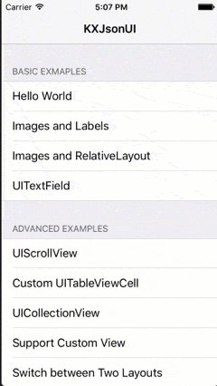

KXJsonUI
===

[](http://cocoadocs.org/docsets/KXJsonUI)
[](http://cocoadocs.org/docsets/KXJsonUI)
[](http://opensource.org/licenses/MIT)

KXJsonUI is a JSON layout framework for iOS, which enables you contstruct your user interfaces using JSON files. You can build your UI without using interface builder. KXJsonUI utilizes the similar concepts from Android layout managment. With this framework, all UI layout can be arranged using 
**KXLinearLayout** and **KXRelativeLayout** classes.

# Features
- Create and manage UIViews using JSON text files
- Supports RelativeLayout and LinearLayout
- Suppports rotations
- Supports UITableViewCell and UICollectionViewCell
- Supports adding unknown view class
- Supports dynamic change layouts 

# Requirements

Requires iOS 8.0+ and ARC.

# Installation

### CocoaPods
The easiest way of installing KXJsonUI is via [CocoaPods](http://cocoapods.org/). 

```
pod 'KXJsonUI'
```

### Old-fashioned way

- Add all subfolders and `*.h, *.m, *.mm` from folder `KXJsonUI_ios/KXJsonUI_ios/` to your project.
- Add `QuartzCore.framework` to your linked frameworks.
- `#import "KXJsonUI_ios.h"` where you want to use the framework.

# Usage

## Include the header
```
#import <KXJsonUI_ios/KXJsonUI_ios.h>
``` 
## Load UI from a JSON file

Load UI layout from a JSON file is easy.
Asume the JSON file you are going to load is named **helloworld.json**. Also, please ensure that the file has been added into the project.

`KXBuilder` is used to parse and build the UI layout from a JSON file.

Add a property of type `KXBuilder*` in YourViewController.h file.

```objective-c
@property(nonatomic, strong) KXBuilder *builder;
```

Load the JSON file in `-(void) viewDidLoad` method in YourViewController.m

```objective-c
- (void)viewDidLoad {
    [super viewDidLoad];
    
    self.builder = [[KXBuilder alloc] init];
    if( [self.builder loadFileWithName: @"helloworld.json"] ){
        [self.builder buildLayoutInView:self.view];
    }
}
```

That's all! Start the view controller and you can see all the UIViews are constructed according to the content of the JSON file. 

# Detailes about layout structure

UIViews in a view controller can be written in a JSON file. 
The basic structure of a layout file looks like below,

```json
{  
  "layout": {    
      "name": "root",
      "widget": "CLASS_NAME_OF_A_UIVIEW_CLASS",      
      "attr": [
        {
          "name": "size",
          "value": {
            "width": "match_parent",
            "height": "match_parent"
          }
        }        
      ],
      "subviews": [         
      ]
  }
}

```
All UIViews are represented in a nested structure.
The root view of the layout must be named as `root`. The value of the attribute `widget` is the class name of a UIView class. For instance, the value of `widget` can be one of the following classes: `UIView`, `UIButton`, `UILable`, ... etc. 

The value of `attr` is an array, which contains one or more than one attributes of the view. Each attribute is represented as a `name`,`value` pair. For instance, the color and size and other attributes can be configured in `attrs`.

The value of `subviews` is an array, which contains the property fot its subviews. Any view can have zero or more than one subviews.

The value of `widget` for the **root view** usually equals to **KXLinearLayout** or **KXRelativeLayout**. In most cases, we use these classes to manage our views for different screen sizes.

## Example

Here is a simple exmple of a view controller, which contains one label and two buttons. 

Example JSON file

```json
{  
  "layout": {    
      "name": "root",
      "widget": "KXLinearLayout",      
      "attr": [
        {
          "name": "size",
          "value": {
            "width": "match_parent",
            "height": "match_parent"
          }
        },
        {
          "name": "orientation",
          "value": "vertical"
        },
        {
          "name": "color",
          "value": "#ffffff"
        }
      ],
      "subviews": [
        {
          "name": "label1",
          "widget": "UILabel",
          "attr": [
            {
              "name": "size",
              "value": {
                "width": "match_parent",
                "height": "auto"
              }
            },
            {
              "name": "color",
              "value": "yellow"
            },
            {
              "name": "weight",
              "value": 1
            },
            {
              "name": "text",
              "value": "Hello! This is label1!"
            },
            {
              "name": "text_color",
              "value": "#202020"
            },
            {
              "name": "margins",
              "value": {
                "left": "4dp",
                "top": "4dp",
                "right": "4dp",
                "bottom": "4dp"
              }
            }            
          ]
        }
     ]    
  }
}

```

The above exmaple depicts a root view of **KXLineLayout** type and its subview `label1` of UILabel type. 
KXLinearLayout is similar to the LinearLayout in Android. Subviews of a KXLinearLayout are arranged accoring to the **orientation** and **weight** attributes.

## More examples

I'm working on providing more documentation and tutorials. If you want to learn more about this framework, it is recommended to check out the exmaples in the **KXJsonUIDemo** project.


